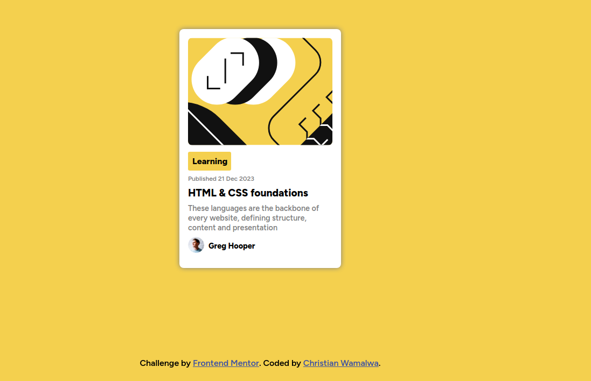

# Frontend Mentor - Blog preview card solution

This is a solution to the [Blog preview card challenge on Frontend Mentor](https://www.frontendmentor.io/challenges/blog-preview-card-ckPaj01IcS). Frontend Mentor challenges help you improve your coding skills by building realistic projects.

## Table of contents

- [Overview](#overview)
  - [The challenge](#the-challenge)
  - [Screenshot](#screenshot)
  - [Links](#links)
- [My process](#my-process)
  - [Built with](#built-with)
- [Author](#author)

## Overview

The Frontend Mentor Blog preview card challenge is a simple challenge that requires the developer to build out a blog preview card and get it looking as close to the design as possible.

### The challenge

Users should be able to:

- See hover and focus states for all interactive elements on the page

### Screenshot

### Links

- Solution URL: [Solution URL here](https://github.com/10-menachi/blog_card)
- Live Site URL: [Live site URL here](https://10-menachi.github.io/blog_card/)

## My process

### Built with

- Semantic HTML5 markup
- CSS custom properties
- Flexbox
- Mobile-first workflow

## Author

- Website - [Christian Wamalwa](https://10-menachi.github.io/portfolio/)
- Frontend Mentor - [@10-menachi](https://www.frontendmentor.io/profile/10-menachi)
- Twitter - [@christian_timbe](https://www.twitter.com/christian_timbe)
